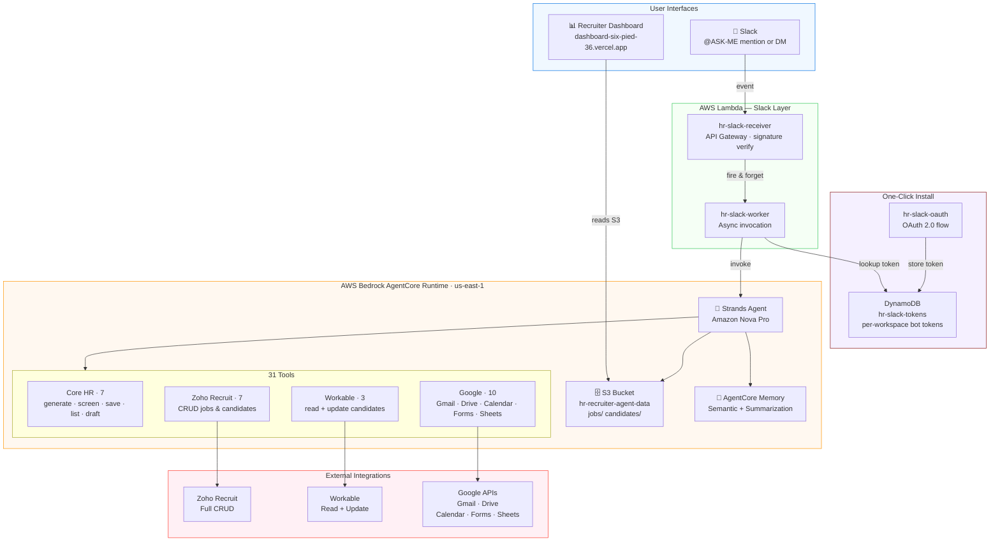

# ASK-ME — AI Recruiting Agent for Slack

An autonomous AI recruiting agent built on **AWS Bedrock AgentCore** with the **Strands Agents SDK**. ASK-ME manages the full hiring pipeline end-to-end through natural conversation in Slack — from writing job descriptions to screening resumes, scheduling interviews, and syncing results back to your ATS.

> **Not a harness. Not a template.** Every tool is hand-coded Python — 31 custom functions calling real external APIs with full auth flows, error handling, and response parsing. Deployed to AgentCore Runtime as a CodeZip build.

[](LICENSE)
[](https://aws.amazon.com/bedrock/)
[](https://strandsagents.com)

---

## What it does

A hiring manager talks to the agent in Slack like a colleague. The agent handles everything:

```
"Create a job for a Python Engineer and post it to Zoho Recruit"
→ Writes the JD, saves it, posts it to Zoho — all in one shot.

"Pull all candidates from Workable and screen them"
→ Fetches candidates, runs AI scoring 0-100, pushes results back to Workable.

"Schedule an interview with john@example.com tomorrow at 2pm"
→ Checks availability, creates Google Meet event, sends email invite.
```

---

## Architecture



---

## Tech Stack

| Layer | Technology |
|---|---|
| AI Agent | AWS Bedrock AgentCore + Strands Framework |
| LLM | Amazon Nova Pro |
| Agent Memory | AgentCore Memory (Semantic + Summarization) |
| Storage | Amazon S3 |
| Slack Integration | AWS Lambda + API Gateway |
| Dashboard | Next.js 16, Tailwind CSS, deployed on Vercel |
| ATS | Zoho Recruit (full CRUD), Workable (read + update) |
| Communication | Gmail API, Google Calendar API |
| Documents | Google Drive API, Google Forms API, Google Sheets API |
| Infrastructure | AWS CDK (via AgentCore CLI) |

---

## 31 Tools

### Core HR (7)
| Tool | Description |
|---|---|
| `generate_job_posting` | AI writes a complete job description |
| `save_job_posting` | Saves JD to S3 |
| `list_job_postings` | Lists all open roles |
| `screen_resume` | AI scores a resume 0-100 against job requirements |
| `save_candidate` | Saves screening record to S3 |
| `list_candidates` | Shows ranked candidate dashboard |
| `draft_interview_email` | Writes a ready-to-send interview invite |

### Google (10)
| Tool | Description |
|---|---|
| `send_email_now` | Sends email via Gmail |
| `list_unread_emails` | Checks inbox for new applications |
| `schedule_interview` | Creates Calendar event with Google Meet link |
| `check_availability` | Checks interviewer free/busy slots |
| `read_resume_from_drive` | Reads a resume from Google Drive |
| `save_document_to_drive` | Saves JD or offer letter to Drive |
| `list_drive_files` | Lists HR files in Drive |
| `create_job_application_form` | Creates a Google Form for applicants |
| `list_form_responses` | Reads form submissions |
| `read_sheet` | Reads candidate data from Google Sheets |

### Zoho Recruit (7)
| Tool | Description |
|---|---|
| `list_zoho_jobs` | Lists open jobs |
| `get_zoho_candidates` | Gets candidates |
| `create_zoho_job` | Creates a new job opening |
| `create_zoho_candidate` | Adds a new candidate |
| `associate_candidate_to_job` | Links candidate to job |
| `update_zoho_candidate` | Updates stage and adds screening notes |
| `close_zoho_job` | Closes a filled or cancelled role |

### Workable (3)
| Tool | Description |
|---|---|
| `list_workable_jobs` | Lists jobs |
| `get_workable_candidates` | Gets candidates |
| `update_workable_candidate` | Advances, disqualifies, or comments |

---

## Setup

### Prerequisites
- AWS account with Bedrock AgentCore access
- Python 3.14+
- Node.js 18+
- AgentCore CLI

### 1. Clone the repo
```bash
git clone https://github.com/oscar67-spec/hr-recruiter-agent.git
cd hr-recruiter-agent
```

### 2. Configure environment variables
```bash
cp agentcore/.env.local.example agentcore/.env.local
# Edit agentcore/.env.local with your credentials
```

Create `app/HRRecruiterAgent/.env`:
```env
AWS_REGION=us-east-1
BEDROCK_MODEL_ID=amazon.nova-pro-v1:0
HR_S3_BUCKET=your-bucket-name
HR_S3_PREFIX=hr-agent
MEMORY_NAME=HRRecruiterMemory

GOOGLE_CLIENT_ID=your_google_client_id
GOOGLE_CLIENT_SECRET=your_google_client_secret
GOOGLE_REFRESH_TOKEN=your_google_refresh_token

ZOHO_CLIENT_ID=your_zoho_client_id
ZOHO_CLIENT_SECRET=your_zoho_client_secret
ZOHO_REFRESH_TOKEN=your_zoho_refresh_token

WORKABLE_API_KEY=your_workable_api_key
WORKABLE_SUBDOMAIN=your_workable_subdomain
```

Update `agentcore/agentcore.json` with your real credentials (replacing the `REPLACE_WITH_...` placeholders).

### 3. Deploy the agent
```bash
agentcore deploy --yes
```

### 4. Deploy the dashboard
```bash
cd dashboard
npm install
vercel --prod
```

### 5. Set up Slack
Deploy the Lambda functions in `app/HRRecruiterAgent/slack_lambda/` and configure your Slack app to point to the API Gateway URL.

---

## Google OAuth Setup
```bash
python setup/google_auth.py
```
Follow the prompts to complete the OAuth flow. Copy the refresh token into your `.env`.

---

## Project Structure
```
hr-recruiter-agent/
├── LICENSE
├── README.md
├── AGENT.md                        # Session notes and architecture context
├── agentcore/
│   ├── agentcore.json              # Infrastructure config (AgentCore)
│   ├── aws-targets.json            # AWS account + region
│   └── cdk/                        # Generated CDK code
├── app/HRRecruiterAgent/
│   ├── main.py                     # AgentCore HTTP entrypoint
│   ├── agent.py                    # Strands Agent + 31 tools
│   ├── tools.py                    # Core HR tools
│   ├── google_tools.py             # Google integrations
│   ├── ats_tools.py                # Zoho + Workable integrations
│   ├── storage.py                  # S3 layer
│   ├── memory_manager.py           # AgentCore Memory
│   ├── config.py                   # Environment config
│   └── slack_lambda/               # Slack bot Lambdas
├── dashboard/                      # Next.js recruiter dashboard
│   ├── app/                        # Pages and API routes
│   ├── components/                 # UI components
│   └── lib/                        # S3 client, auth
└── setup/
    └── google_auth.py              # One-time Google OAuth script
```

---

## Built for

**Agents for Humans Hackathon** — Professional Agents Track  
Powered by AWS Bedrock AgentCore

## License

MIT — see [LICENSE](LICENSE)
